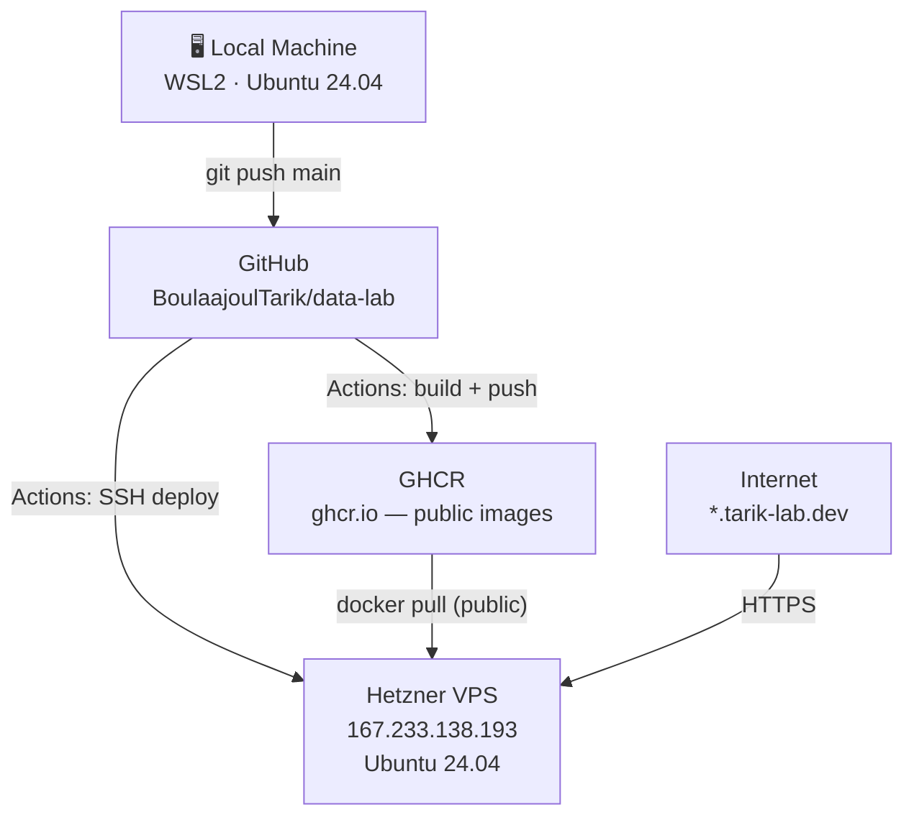

# Ecosystem overview

How the lab's moving parts relate at the highest level: the local machine, GitHub,
GHCR, the public internet, and the Hetzner VPS.

```mermaid
graph TD
    DEV["🖥 Local Machine\nWSL2 · Ubuntu 24.04"]
    GH["GitHub\nBoulaajoulTarik/data-lab"]
    GHCR["GHCR\nghcr.io — public images"]
    INET["Internet\n*.tarik-lab.dev"]
    VPS["Hetzner VPS\n167.233.138.193\nUbuntu 24.04"]

    DEV -- "git push main" --> GH
    GH -- "Actions: build + push" --> GHCR
    GH -- "Actions: SSH deploy" --> VPS
    GHCR -- "docker pull (public)" --> VPS
    INET -- "HTTPS" --> VPS
```
