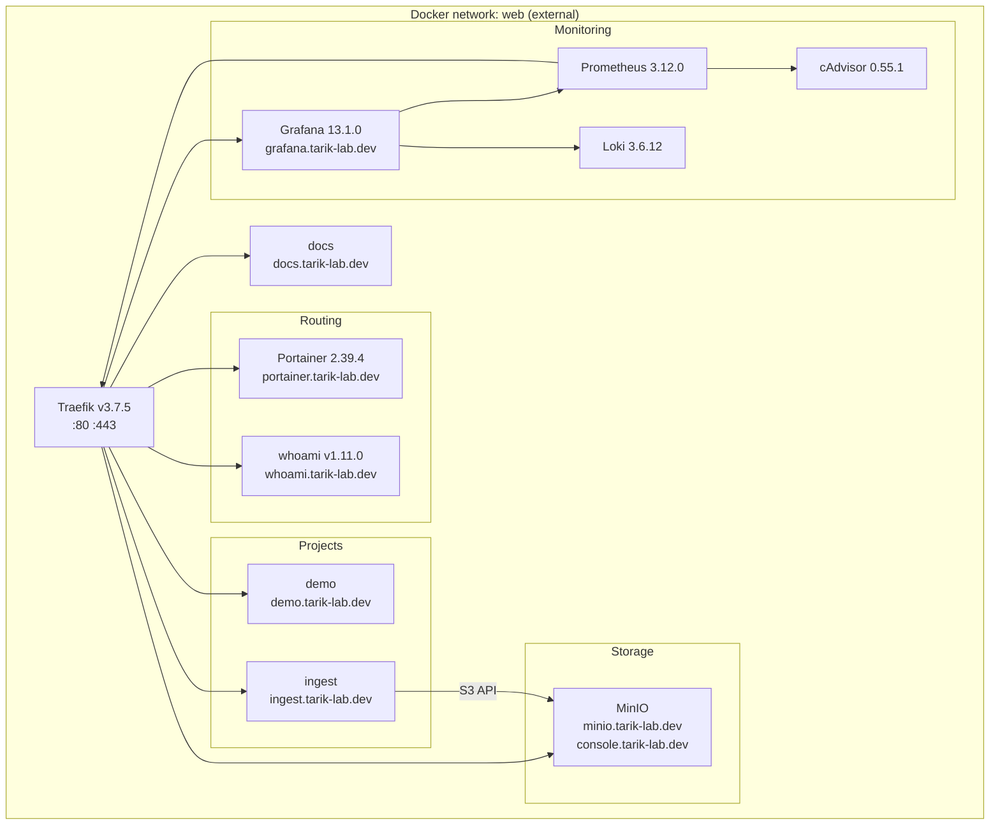

# Shared infrastructure internals

All services share the external `web` Docker network. Traefik is the only service that
binds host ports (80/443). Every other service is reached by Traefik via the network.

