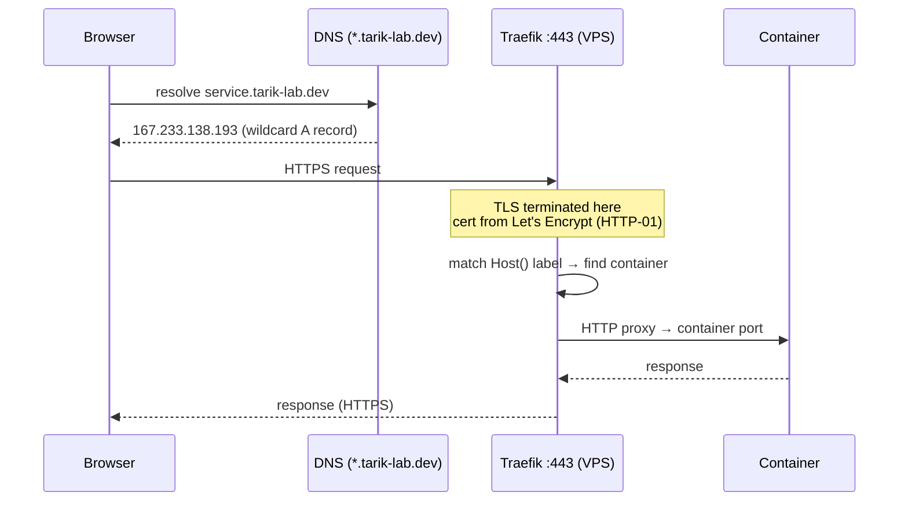

# Request routing

How a browser request reaches a container — from DNS through TLS termination to the app.

## How Traefik discovers routes

Traefik watches the Docker socket (`/var/run/docker.sock:ro`). When a container joins the
`web` network with `traefik.enable=true` labels, Traefik automatically:

1. Creates an HTTPS router matching the `Host()` rule
2. Requests a Let's Encrypt cert via HTTP-01 on port 80
3. Proxies traffic to the container's specified port

No config reload needed — new services are picked up instantly.
