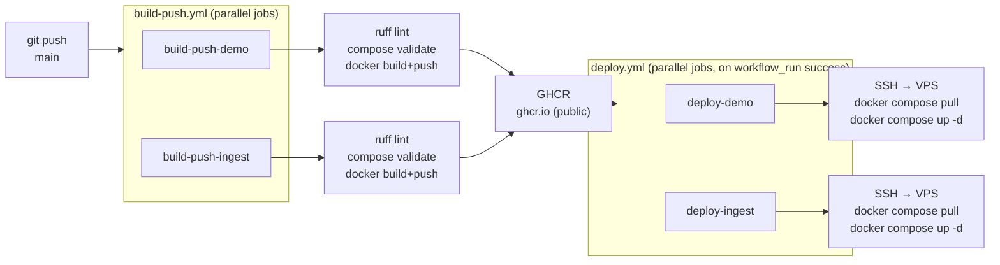

# CI/CD pipeline

Every push to `main` triggers a two-stage pipeline: build + push to GHCR, then SSH deploy to the VPS.

## Key design choices

- **Public GHCR images** — no pull token needed on the VPS
- **Parallel jobs** — demo and ingest build and deploy independently
- **Quality gates** — ruff lint + `docker compose config` validate before every push
- **workflow_run trigger** — deploy only fires after a fully green build
