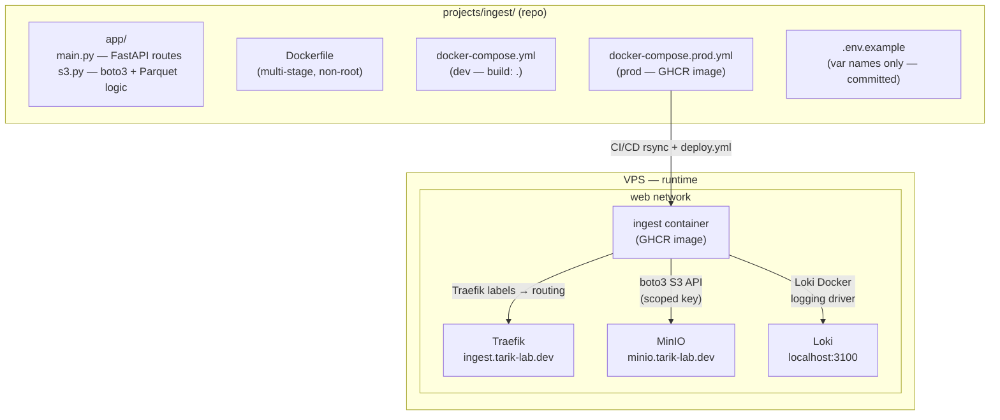

# Project anatomy

The structure of a single data project — using `ingest` as the example.

## Network rules

- **`web` (external):** public services only — join it to get a Traefik route
- **`internal` (per-project):** backing services (DBs, workers) — no Traefik labels, not routable

## Secrets model

| Zone | Where | How |
|---|---|---|
| Zone 1 | Local `.env` (gitignored) | Used by `make project-up` |
| Zone 2 | GitHub Actions secrets | Used by CI/CD workflows |
| Zone 3 | VPS `~/projectname/.env` | Set manually, never in git |
